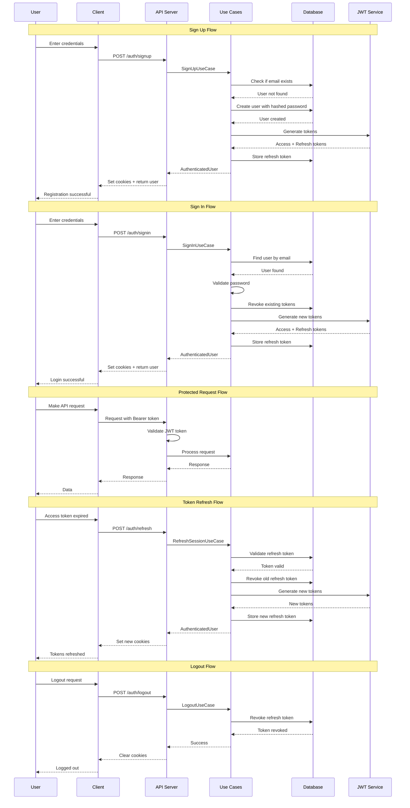
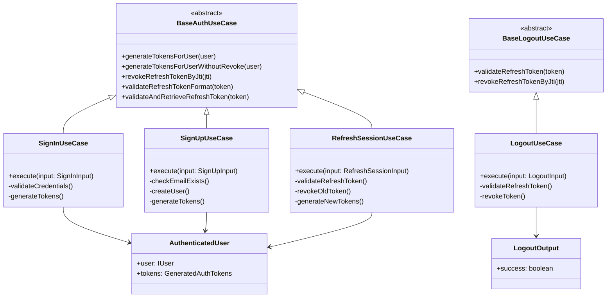
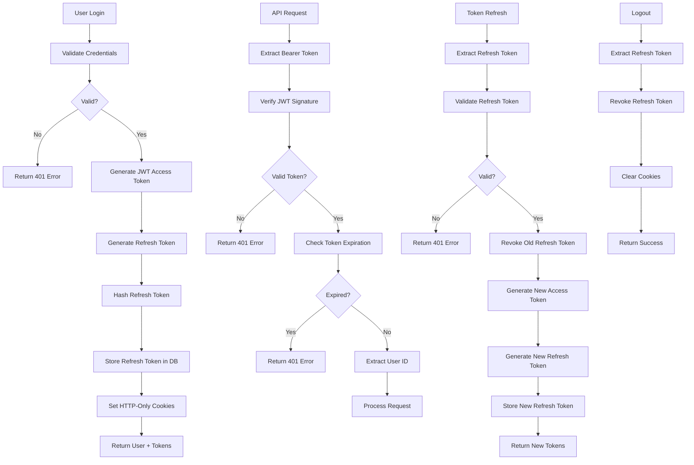
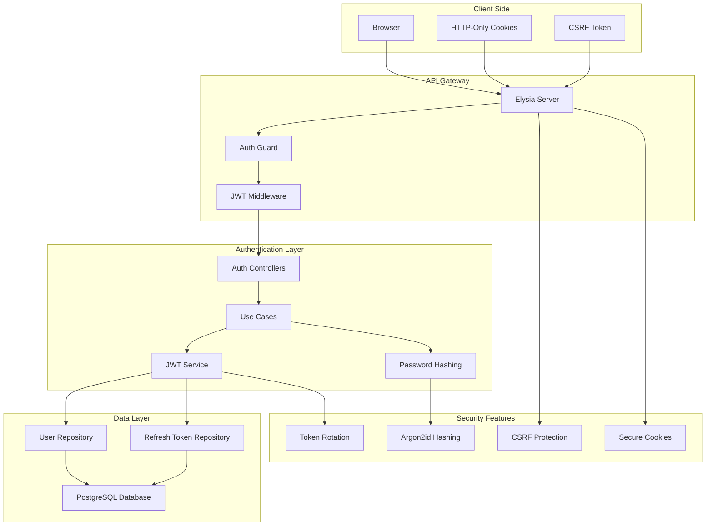
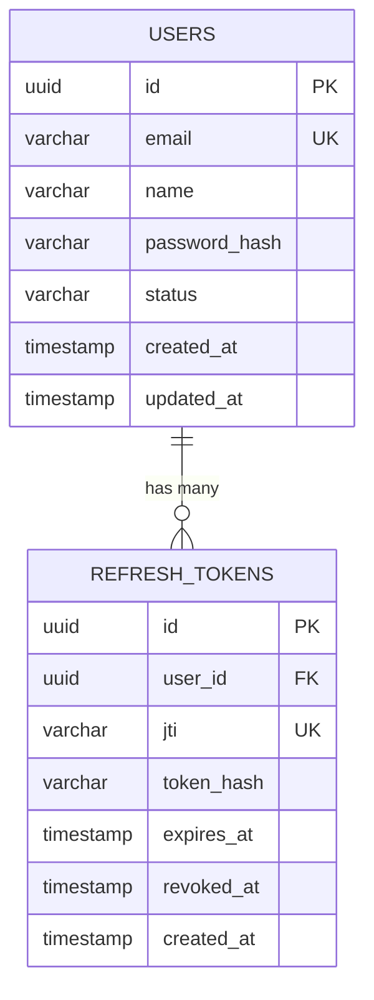
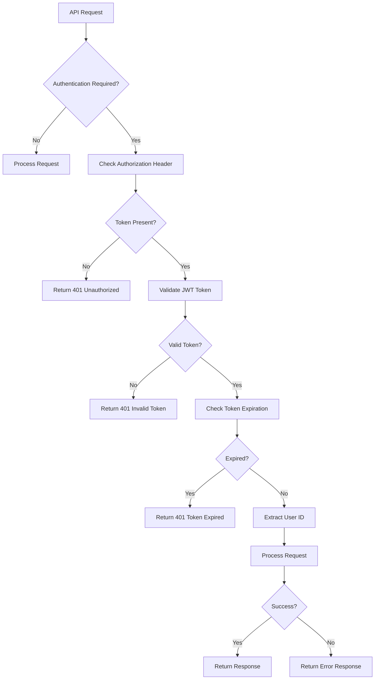

# Authentication Flow Diagrams

## 1. Complete Authentication Flow



## 2. Use Case Architecture Diagram



## 3. JWT Token Flow Diagram



## 4. Security Architecture Diagram



## 5. Database Schema Diagram



## 6. Error Handling Flow



## 7. Cookie Management Flow

```mermaid
sequenceDiagram
    participant C as Client
    participant S as Server
    participant DB as Database

    Note over C,DB: Setting Cookies
    C->>S: Login Request
    S->>S: Generate Tokens
    S->>DB: Store Refresh Token
    S->>C: Set-Cookie: access_token=xxx; HttpOnly; Secure; SameSite=Strict
    S->>C: Set-Cookie: refresh_token=xxx; HttpOnly; Secure; SameSite=Strict
    S->>C: Set-Cookie: csrf_token=xxx; HttpOnly; Secure; SameSite=Strict

    Note over C,DB: Using Cookies
    C->>S: API Request with Cookies
    S->>S: Extract tokens from cookies
    S->>S: Validate tokens
    S->>C: Response

    Note over C,DB: Clearing Cookies
    C->>S: Logout Request
    S->>DB: Revoke refresh token
    S->>C: Set-Cookie: access_token=; expires=Thu, 01 Jan 1970 00:00:00 GMT
    S->>C: Set-Cookie: refresh_token=; expires=Thu, 01 Jan 1970 00:00:00 GMT
    S->>C: Set-Cookie: csrf_token=; expires=Thu, 01 Jan 1970 00:00:00 GMT
```
